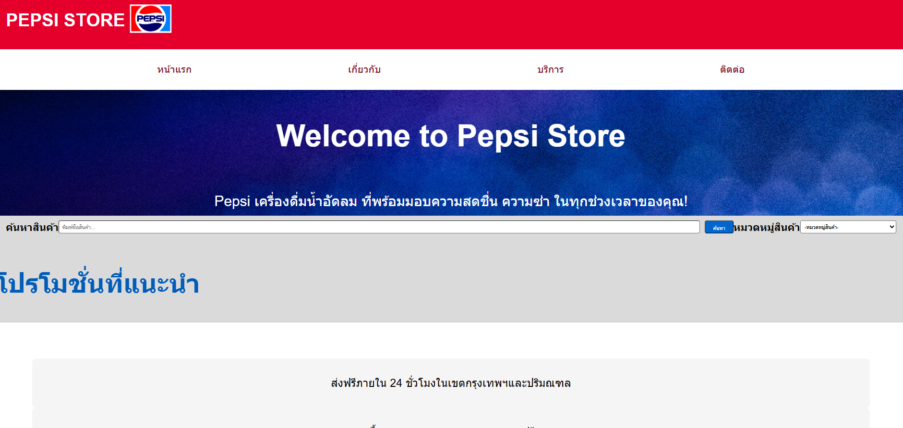
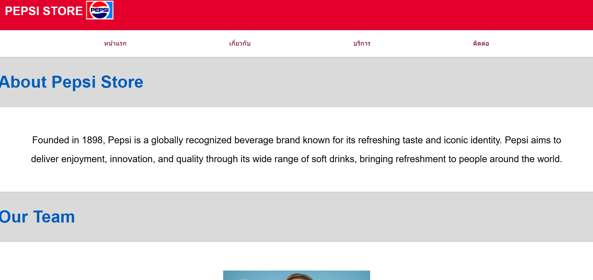
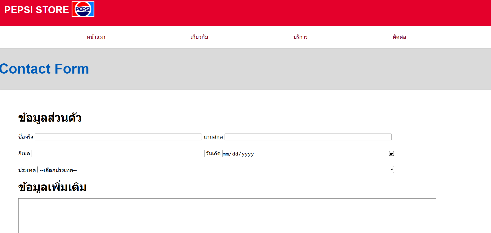
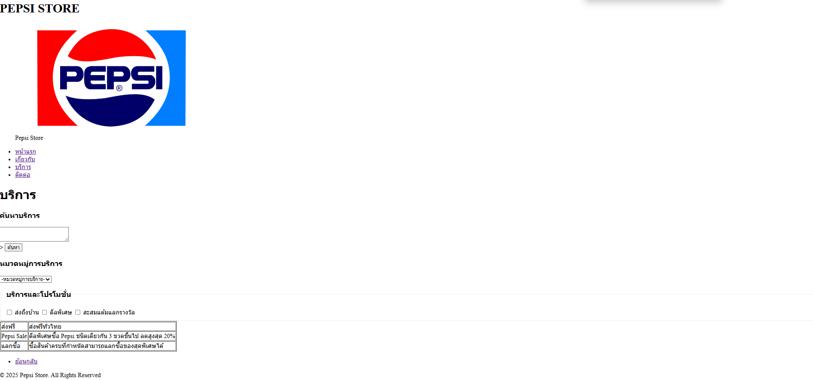

<strong>ชื่อโปรเจค:</strong> Ppesi Store
<strong>คำอธิบายโปรเจค:</strong> โปรเจคตัวอย่างของร้านขายน้ำอัดลม Pepsi

<strong>โครงสร้างไฟล์:</strong>
my business web/
├──about.html
├──contact.html
├──index.html
├──README.md
├──services.html
│
└──images/
├──CEO.jpg
├──Map.png
├──Pepsi-Logo.png
└──...

<strong>รูปหน้าจอทั้งหมด:</strong>
index.html

about.html

contact.html

services.html

<ul>
  <li><a href="index.html">หน้าแรก</a></li>
  <li><a href="about.html">เกี่ยวกับ</a></li>
  <li><a href="services.html">บริการ</a></li>
  <li><a href="contact.html">ติดต่อ</a></li>
</ul>
